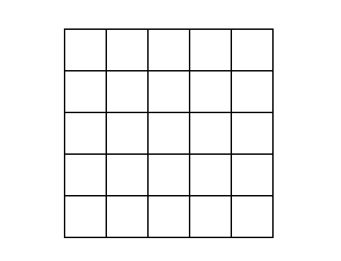
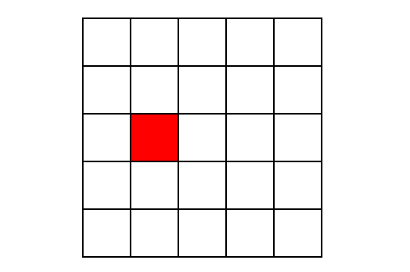
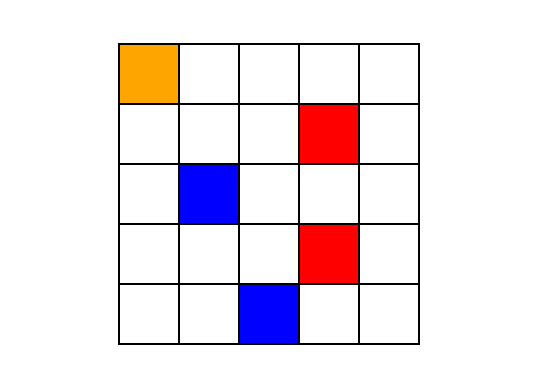

# Glowing Lamp
## A colorful puzzle built with Elmish. 

The board consists of 25 squares:



When you click on one of the squares it changes color:



If you keep clicking, all the old squares change colors also:



Can you figure out the pattern?

See the game in action at [taylnath.github.io/glowing-lamp-elmish](http://taylnath.github.io/glowing-lamp-elmish).

## Building and running the app

First of all, start with installing the project's npm dependencies
```bash
npm install
```
Once this is finished, you can then build and compile the project:
```
npm run build
```
You can start developing the application in watch mode using the webpack development server:
```
npm start
```
After the first compilation is finished, navigate to http://localhost:8080 in your browser to see the application.

### VS Code

If you happen to use Visual Studio Code, simply hitting F5 will start the development watch mode for you and opens your default browser navigating to http://localhost:8080.